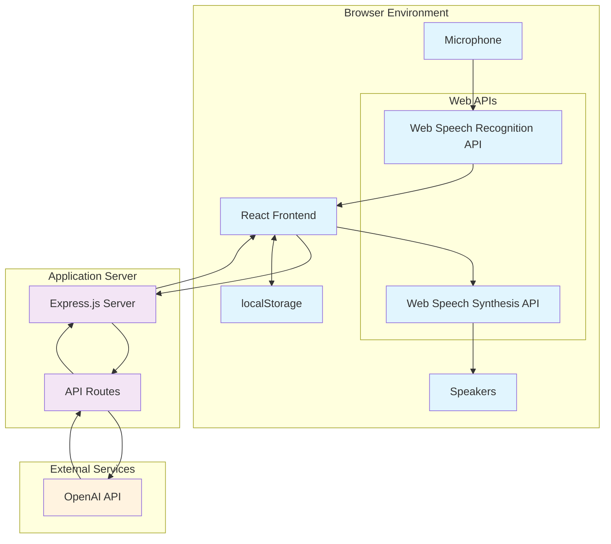
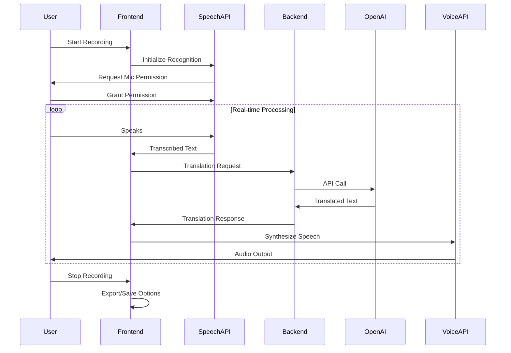

# Real-Time Speech Translation App

A browser-based real-time speech translation application that captures audio, transcribes it, translates the text using OpenAI API, and plays back the translation using web audio synthesis.

## Features

- **Real-time speech recognition** - Captures audio from microphone and transcribes speech
- **AI-powered translation** - Uses OpenAI GPT models for accurate translation
- **Voice synthesis** - Automatically plays translated text with appropriate voice for target language
- **Multi-language support** - Supports 10+ languages for both input and output
- **Smart voice selection** - Automatically selects best voice for target language
- **Export functionality** - Export transcripts and translations in TXT, JSON, or CSV formats
- **Dark/Light themes** - Toggle between light and dark interface themes
- **Bilingual UI** - Interface available in Russian and English
- **Privacy-focused** - All data processed locally, API key stored in browser only

## Supported Languages

**Source Languages (Speech Recognition):**
- Russian (ru-RU)
- English (en-US) 
- Spanish (es-ES)
- French (fr-FR)
- German (de-DE)
- Italian (it-IT)
- Portuguese (pt-PT)
- Chinese (zh-CN)
- Japanese (ja-JP)
- Korean (ko-KR)

**Target Languages (Translation):**
- English, Russian, Spanish, French, German, Italian, Portuguese, Chinese, Japanese, Korean

## Architecture

### System Architecture Diagram



### Component Interaction Flow



### Technology Stack

#### Frontend
- **React 18** with TypeScript for type safety
- **Vite** for fast development and builds
- **Tailwind CSS + Shadcn UI** for modern, responsive design
- **Web Speech API** for real-time speech recognition
- **Web Audio API** for speech synthesis
- **localStorage** for settings persistence
- **TanStack Query** for API state management

#### Backend
- **Node.js + Express** for lightweight HTTP server
- **OpenAI API** integration for translation services
- **TypeScript** for full-stack type safety
- **Railway.app** ready for cloud deployment

### Key Components

```
├── client/src/
│   ├── components/          # Reusable UI components
│   │   ├── ui/             # Shadcn UI components
│   │   ├── settings-modal.tsx
│   │   ├── privacy-modal.tsx
│   │   └── export-modal.tsx
│   ├── hooks/              # Custom React hooks
│   │   ├── use-speech-recognition.ts
│   │   ├── use-speech-synthesis.ts
│   │   └── use-translation.ts
│   ├── lib/                # Utility libraries
│   │   ├── i18n.ts         # Internationalization
│   │   ├── storage.ts      # localStorage utilities
│   │   └── translation-service.ts
│   └── pages/
│       └── translator.tsx  # Main application page
├── server/
│   ├── index.ts           # Express server setup
│   └── routes.ts          # API routes
└── shared/
    └── schema.ts          # Shared TypeScript types
```

## Prerequisites

- Node.js 20+ 
- OpenAI API key (required for translation functionality)

## Installation & Setup

1. **Clone the repository:**
   ```bash
   git clone <repository-url>
   cd speech-translation-app
   ```

2. **Install dependencies:**
   ```bash
   npm install
   ```

3. **Start the development server:**
   ```bash
   npm run dev
   ```

4. **Open your browser:**
   Navigate to `http://localhost:5000`

## Usage Guide

### Initial Setup

1. **Privacy Consent:** When first opening the app, you'll see a privacy modal explaining data usage. Click "I Agree" to proceed.

2. **Configure Settings:** Click the settings icon (⚙️) to open configuration:
   - **Source Language:** Language you'll speak in
   - **Target Language:** Language to translate to
   - **OpenAI Model:** Choose between GPT-4o (optimal), GPT-4 (accurate), or GPT-3.5 Turbo (fast)
   - **OpenAI API Key:** Enter your API key from https://platform.openai.com/
   - **Voice:** Select automatic voice selection or specific voice for target language
   - **Speech Rate:** Adjust playback speed (0.5x to 2x)

### Translation Process

1. **Start Recording:** Click the "Start Recording" button
2. **Grant Microphone Permission:** Allow browser access to microphone
3. **Speak:** Say something in your source language
4. **View Results:** See real-time transcription and translation
5. **Listen:** Translated text is automatically played back
6. **Stop Recording:** Click "Stop Recording" when finished

### Advanced Features

- **Export Data:** Click "Export" to download transcripts in various formats
- **Clear History:** Use "Clear" button to remove all transcripts
- **Theme Toggle:** Switch between light/dark themes
- **Language Switch:** Toggle UI between Russian/English
- **Error Handling:** Automatic retry system for failed translations

### Smart Voice Selection

The app automatically selects the best voice for your target language:
- Chinese translations use Chinese voices
- Japanese translations use Japanese voices  
- Russian translations use Russian voices
- And so on for all supported languages

## API Configuration

### OpenAI API Key Setup

1. Visit https://platform.openai.com/
2. Create an account or sign in
3. Navigate to API Keys section
4. Generate a new API key
5. Enter the key in app settings

**Note:** OpenAI API usage is paid. Costs are typically very low for normal usage but depend on:
- Selected model (GPT-4o, GPT-4, GPT-3.5 Turbo)
- Amount of text translated
- Frequency of requests

### Privacy & Security

- **Local Storage Only:** API key stored only in your browser
- **No Server Storage:** Transcripts and translations not saved on server
- **HTTPS Required:** All API communication encrypted
- **GDPR/CCPA Compliant:** Minimal data collection, user consent required

## Deployment

### Railway.app (Recommended)

1. Connect your GitHub repository to Railway
2. Railway will automatically detect and deploy the app
3. Environment variables are managed through Railway dashboard

### Manual Deployment

1. **Build the application:**
   ```bash
   npm run build
   ```

2. **Start production server:**
   ```bash
   npm start
   ```

## Troubleshooting

### Common Issues

**Speech Recognition Not Working:**
- Ensure microphone permission is granted
- Check if browser supports Web Speech API
- Try refreshing the page

**Translation Fails:**
- Verify OpenAI API key is correct
- Check API key has sufficient credits
- Ensure stable internet connection

**Voice Synthesis Silent:**
- Check if browser supports Web Audio API
- Ensure device volume is not muted
- Try selecting different voice in settings

**Performance Issues:**
- Reduce chunk size in advanced settings
- Switch to faster OpenAI model (GPT-3.5 Turbo)
- Clear browser cache

### Browser Compatibility

**Recommended Browsers:**
- Chrome 80+
- Firefox 75+
- Safari 14+
- Edge 80+

**Required Features:**
- Web Speech API support
- Web Audio API support
- localStorage support
- Modern JavaScript (ES2020+)

## Development

### Project Scripts

```bash
npm run dev          # Start development server
npm run build        # Build for production
npm run start        # Start production server
npm run lint         # Run ESLint
npm run type-check   # Run TypeScript checks
```

### Code Structure

- **Frontend:** React components with TypeScript
- **Backend:** Express.js with TypeScript
- **Shared:** Common types and schemas
- **Styling:** Tailwind CSS with dark mode support
- **State Management:** React hooks + TanStack Query

## Contributing

1. Fork the repository
2. Create a feature branch
3. Make your changes
4. Add tests if applicable
5. Submit a pull request

## License

This project is licensed under the MIT License.

## Support

For issues and questions:
1. Check the troubleshooting section above
2. Review browser compatibility requirements
3. Ensure all prerequisites are met
4. Verify OpenAI API key configuration

---

**Note:** This application requires an active internet connection and OpenAI API access for translation functionality. Speech recognition and synthesis work offline using browser APIs.