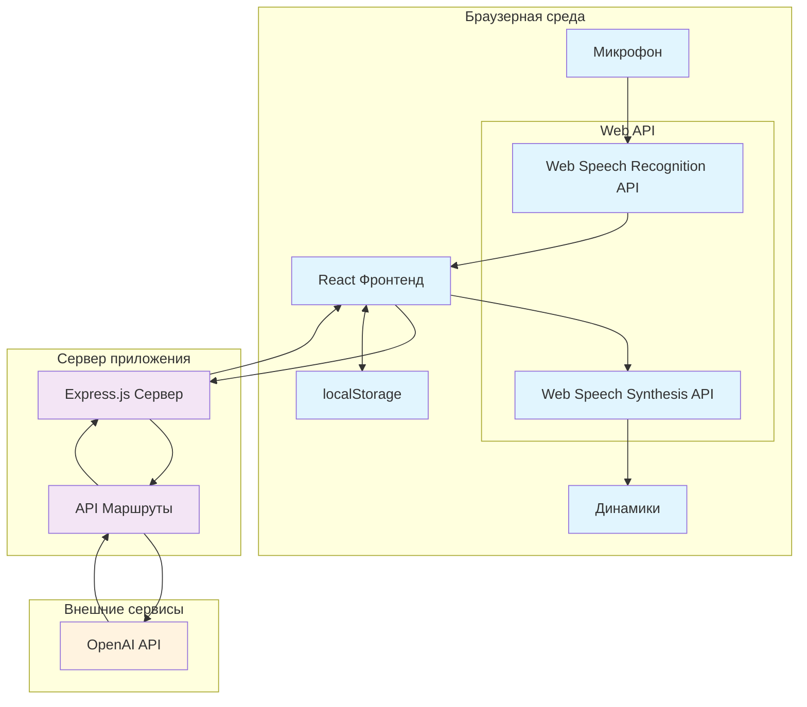
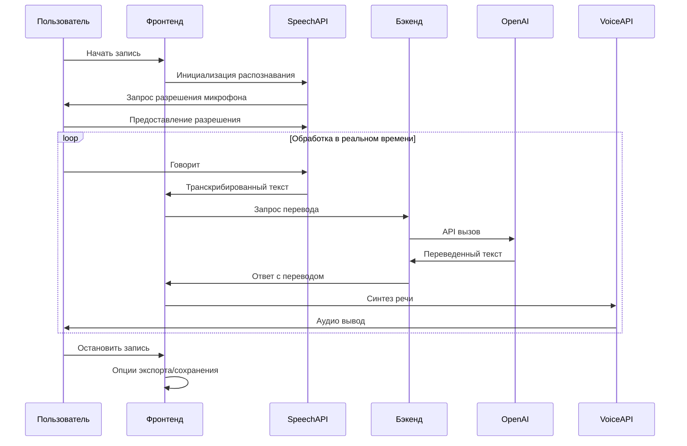

# Приложение для синхронного перевода речи

Браузерное приложение для перевода речи в реальном времени, которое захватывает аудио, транскрибирует его, переводит текст с помощью OpenAI API и воспроизводит перевод с использованием веб-синтеза речи.

## Возможности

- **Распознавание речи в реальном времени** - Захватывает аудио с микрофона и транскрибирует речь
- **ИИ-перевод** - Использует модели OpenAI GPT для точного перевода
- **Синтез речи** - Автоматически воспроизводит переведенный текст подходящим голосом для целевого языка
- **Поддержка множества языков** - Поддерживает 10+ языков для ввода и вывода
- **Умный выбор голоса** - Автоматически выбирает лучший голос для целевого языка
- **Функция экспорта** - Экспорт транскрипций и переводов в форматах TXT, JSON или CSV
- **Темная/светлая темы** - Переключение между светлой и темной темами интерфейса
- **Двуязычный интерфейс** - Интерфейс доступен на русском и английском языках
- **Конфиденциальность** - Все данные обрабатываются локально, API ключ хранится только в браузере

## Поддерживаемые языки

**Исходные языки (распознавание речи):**
- Русский (ru-RU)
- Английский (en-US) 
- Испанский (es-ES)
- Французский (fr-FR)
- Немецкий (de-DE)
- Итальянский (it-IT)
- Португальский (pt-PT)
- Китайский (zh-CN)
- Японский (ja-JP)
- Корейский (ko-KR)

**Целевые языки (перевод):**
- Английский, русский, испанский, французский, немецкий, итальянский, португальский, китайский, японский, корейский

## Архитектура

### Диаграмма системной архитектуры



### Поток взаимодействия компонентов



### Технологический стек

#### Фронтенд
- **React 18** с TypeScript для типобезопасности
- **Vite** для быстрой разработки и сборки
- **Tailwind CSS + Shadcn UI** для современного, адаптивного дизайна
- **Web Speech API** для распознавания речи в реальном времени
- **Web Audio API** для синтеза речи
- **localStorage** для сохранения настроек
- **TanStack Query** для управления состоянием API

#### Бэкенд
- **Node.js + Express** для легкого HTTP сервера
- **Интеграция с OpenAI API** для сервисов перевода
- **TypeScript** для типобезопасности всего стека
- **Railway.app** готов для облачного развертывания

### Ключевые компоненты

```
├── client/src/
│   ├── components/          # Переиспользуемые UI компоненты
│   │   ├── ui/             # Компоненты Shadcn UI
│   │   ├── settings-modal.tsx
│   │   ├── privacy-modal.tsx
│   │   └── export-modal.tsx
│   ├── hooks/              # Пользовательские React хуки
│   │   ├── use-speech-recognition.ts
│   │   ├── use-speech-synthesis.ts
│   │   └── use-translation.ts
│   ├── lib/                # Вспомогательные библиотеки
│   │   ├── i18n.ts         # Интернационализация
│   │   ├── storage.ts      # Утилиты localStorage
│   │   └── translation-service.ts
│   └── pages/
│       └── translator.tsx  # Главная страница приложения
├── server/
│   ├── index.ts           # Настройка Express сервера
│   └── routes.ts          # API маршруты
└── shared/
    └── schema.ts          # Общие типы TypeScript
```

## Предварительные требования

- Node.js 20+ 
- OpenAI API ключ (требуется для функциональности перевода)

## Установка и настройка

1. **Клонируйте репозиторий:**
   ```bash
   git clone <repository-url>
   cd speech-translation-app
   ```

2. **Установите зависимости:**
   ```bash
   npm install
   ```

3. **Запустите сервер разработки:**
   ```bash
   npm run dev
   ```

4. **Откройте браузер:**
   Перейдите на `http://localhost:5000`

## Руководство по использованию

### Первоначальная настройка

1. **Согласие на конфиденциальность:** При первом открытии приложения вы увидите модальное окно конфиденциальности, объясняющее использование данных. Нажмите "Я согласен" для продолжения.

2. **Настройте параметры:** Нажмите значок настроек (⚙️) для открытия конфигурации:
   - **Исходный язык:** Язык, на котором вы будете говорить
   - **Целевой язык:** Язык для перевода
   - **Модель OpenAI:** Выберите между GPT-4o (оптимальная), GPT-4 (точная) или GPT-3.5 Turbo (быстрая)
   - **OpenAI API ключ:** Введите ваш API ключ с https://platform.openai.com/
   - **Голос:** Выберите автоматический выбор голоса или конкретный голос для целевого языка
   - **Скорость речи:** Настройте скорость воспроизведения (0.5x до 2x)

### Процесс перевода

1. **Начать запись:** Нажмите кнопку "Начать запись"
2. **Разрешить доступ к микрофону:** Разрешите браузеру доступ к микрофону
3. **Говорите:** Скажите что-то на вашем исходном языке
4. **Просмотр результатов:** Наблюдайте транскрипцию и перевод в реальном времени
5. **Прослушивание:** Переведенный текст автоматически воспроизводится
6. **Остановить запись:** Нажмите "Остановить запись" по завершении

### Дополнительные функции

- **Экспорт данных:** Нажмите "Экспорт" для загрузки транскрипций в различных форматах
- **Очистить историю:** Используйте кнопку "Очистить" для удаления всех транскрипций
- **Переключение темы:** Переключайтесь между светлой/темной темами
- **Переключение языка:** Переключайте интерфейс между русским/английским
- **Обработка ошибок:** Автоматическая система повторных попыток для неудачных переводов

### Умный выбор голоса

Приложение автоматически выбирает лучший голос для вашего целевого языка:
- Китайские переводы используют китайские голоса
- Японские переводы используют японские голоса  
- Русские переводы используют русские голоса
- И так далее для всех поддерживаемых языков

## Настройка API

### Настройка OpenAI API ключа

1. Посетите https://platform.openai.com/
2. Создайте аккаунт или войдите
3. Перейдите в раздел API Keys
4. Сгенерируйте новый API ключ
5. Введите ключ в настройках приложения

**Примечание:** Использование OpenAI API платное. Стоимость обычно очень низкая для обычного использования, но зависит от:
- Выбранной модели (GPT-4o, GPT-4, GPT-3.5 Turbo)
- Количества переведенного текста
- Частоты запросов

### Конфиденциальность и безопасность

- **Только локальное хранение:** API ключ хранится только в вашем браузере
- **Без серверного хранения:** Транскрипции и переводы не сохраняются на сервере
- **Требуется HTTPS:** Вся API коммуникация зашифрована
- **Соответствие GDPR/CCPA:** Минимальный сбор данных, требуется согласие пользователя

## Развертывание

### Railway.app (Рекомендуется)

1. Подключите ваш GitHub репозиторий к Railway
2. Railway автоматически обнаружит и развернет приложение
3. Переменные окружения управляются через панель Railway

### Ручное развертывание

1. **Соберите приложение:**
   ```bash
   npm run build
   ```

2. **Запустите продакшн сервер:**
   ```bash
   npm start
   ```

## Устранение неполадок

### Распространенные проблемы

**Распознавание речи не работает:**
- Убедитесь, что разрешение на микрофон предоставлено
- Проверьте, поддерживает ли браузер Web Speech API
- Попробуйте обновить страницу

**Перевод не работает:**
- Проверьте правильность OpenAI API ключа
- Убедитесь, что на API ключе достаточно кредитов
- Обеспечьте стабильное интернет-соединение

**Синтез речи молчит:**
- Проверьте, поддерживает ли браузер Web Audio API
- Убедитесь, что громкость устройства не отключена
- Попробуйте выбрать другой голос в настройках

**Проблемы с производительностью:**
- Уменьшите размер сегмента в дополнительных настройках
- Переключитесь на более быструю модель OpenAI (GPT-3.5 Turbo)
- Очистите кэш браузера

### Совместимость браузеров

**Рекомендуемые браузеры:**
- Chrome 80+
- Firefox 75+
- Safari 14+
- Edge 80+

**Требуемые функции:**
- Поддержка Web Speech API
- Поддержка Web Audio API
- Поддержка localStorage
- Современный JavaScript (ES2020+)

## Разработка

### Скрипты проекта

```bash
npm run dev          # Запустить сервер разработки
npm run build        # Собрать для продакшна
npm run start        # Запустить продакшн сервер
npm run lint         # Запустить ESLint
npm run type-check   # Запустить проверки TypeScript
```

### Структура кода

- **Фронтенд:** React компоненты с TypeScript
- **Бэкенд:** Express.js с TypeScript
- **Общее:** Общие типы и схемы
- **Стили:** Tailwind CSS с поддержкой темной темы
- **Управление состоянием:** React хуки + TanStack Query

## Вклад в проект

1. Сделайте форк репозитория
2. Создайте ветку функции
3. Внесите ваши изменения
4. Добавьте тесты, если применимо
5. Отправьте pull request

## Лицензия

Этот проект лицензирован под лицензией MIT.

## Поддержка

Для вопросов и проблем:
1. Проверьте раздел устранения неполадок выше
2. Просмотрите требования совместимости браузеров
3. Убедитесь, что все предварительные требования выполнены
4. Проверьте конфигурацию OpenAI API ключа

---

**Примечание:** Это приложение требует активного интернет-соединения и доступа к OpenAI API для функциональности перевода. Распознавание и синтез речи работают офлайн с использованием браузерных API.